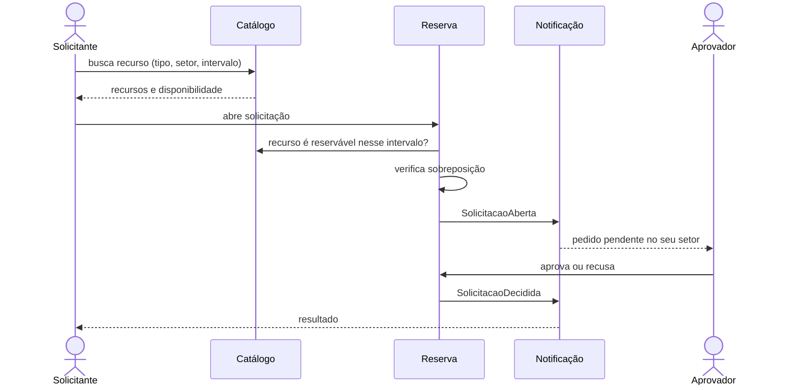

# Visão do Produto

## Problema

A reserva de espaços (salas, laboratórios, anfiteatros) e de materiais/equipamentos na instituição é descentralizada, variando conforme o setor responsável por cada recurso. Essa pulverização dificulta a consulta unificada da disponibilidade em um único local, exigindo checagens pontuais com cada departamento ou secretaria e aumentando a ocorrência de divergências nos horários agendados.

## Proposta

Um ponto único de entrada para consultar o que existe, ver a disponibilidade e solicitar reserva.

O sistema administra diretamente os recursos cadastrados nele. Para os recursos cuja reserva acontece em outro sistema institucional, registra o caminho oficial — assim a consulta é unificada mesmo antes de existir qualquer integração.

Como cada setor tem a sua própria política de reserva, **as regras são dado configurável, não código**: quem pode solicitar, se a confirmação é automática ou depende de aprovação, qual a antecedência exigida e que precedência existe entre finalidades são atributos administrados pela interface. É essa genericidade que permite atender setores diferentes sem uma versão do sistema para cada um.

## Público

- **Solicitantes** — discentes, docentes, técnicos e servidores.
- **Responsáveis e administradores de setor** — decidem sobre os recursos do seu setor.
- **Administração geral** — visão consolidada de todos os setores.

Níveis de acesso distintos, com escopo limitado ao setor quando for o caso.

## A transação que atravessa contextos

Três contextos delimitados: **Catálogo** (o que existe e sua disponibilidade), **Reserva** (solicitações e seu ciclo de vida) e **Notificação** (o que cada parte precisa saber).

> Um solicitante **consulta o Catálogo**, **abre uma Solicitação** que é avaliada por quem responde pelo recurso e validada contra sobreposição, e cada mudança de estado **dispara uma Notificação**.

Reserva **publica eventos**; Notificação **assina**. É essa fronteira que mantém os contextos independentes.

## Escopo

**Este semestre (MVP)** — o produto mínimo viável, isto é, a menor fatia que funciona de ponta a ponta: catálogo de recursos, perfis com escopo por setor, ciclo completo de solicitação com aprovação e verificação de conflito, notificações e histórico auditável. Sem dependência de nenhum sistema externo.

**Depois** — integração com os sistemas institucionais que já registram reservas hoje; e, como hipótese, tornar o sistema reutilizável por outras instituições.

Requisitos detalhados em [requisitos.md](requisitos.md).

## Percurso arquitetural

O ponto de partida é um **monólito modular**, com os três contextos como módulos de fronteira explícita. Ao longo da disciplina, o mesmo sistema será remontado em outras arquiteturas.

O que sobrevive a cada migração — e por isso não é detalhe de implementação — é a transação acima, as regras de negócio e os testes de aceitação, escritos contra o comportamento e não contra a estrutura. Cada migração vira um ADR que substitui o anterior.

Consequência: **cada requisito a mais é um requisito a mais para migrar a cada arquitetura.** Escopo enxuto é a condição para o percurso caber no semestre.

## Definições assentadas

- O recurso é reservado **inteiro** — não se reservam partes dele.
- O período é um **intervalo livre de data e hora**, com granularidade de hora. Não há grade fixa de turnos.
- Um recurso pode ser **compartilhado entre setores**.
- A confirmação pode ser automática ou exigir aprovação, conforme a regra do recurso.
- Aprova quem tem a **permissão**, atribuída por perfil ou diretamente ao usuário. Permissões são **cumulativas**: atribuição direta concede, nunca revoga o que o perfil deu.

## Fora de escopo

Reserva recorrente; cobrança pelo uso; controle de acesso físico; aplicativo mobile nativo; substituir os fluxos dos sistemas institucionais existentes.

## Perguntas em aberto

1. Quais sistemas institucionais são fonte de verdade sobre reservas hoje, e são consultáveis por API?

> Enquanto não houver resposta, adota-se a opção mais simples, registrada como ADR.
